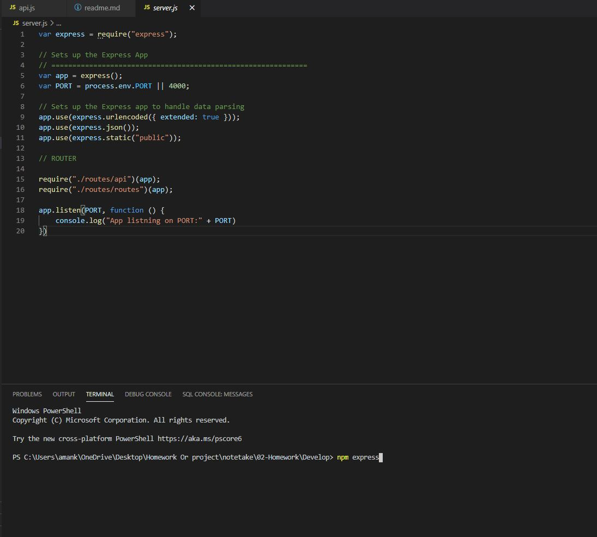
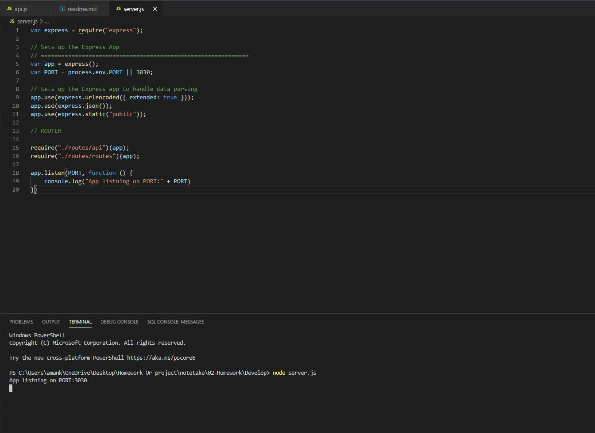
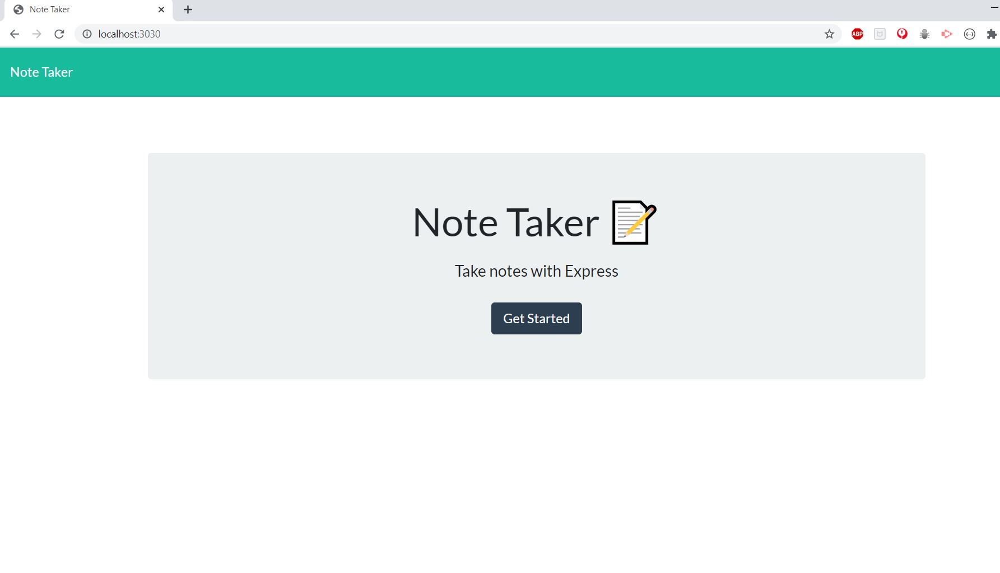
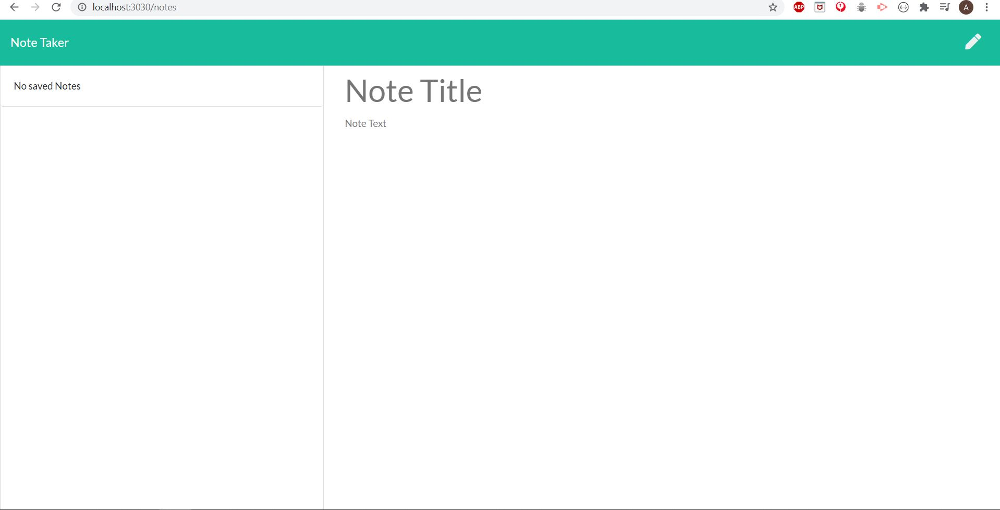
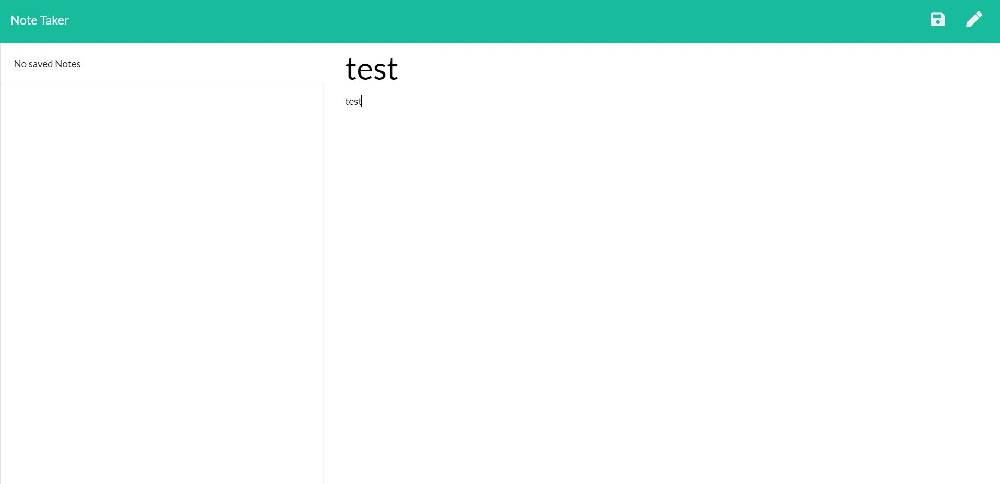
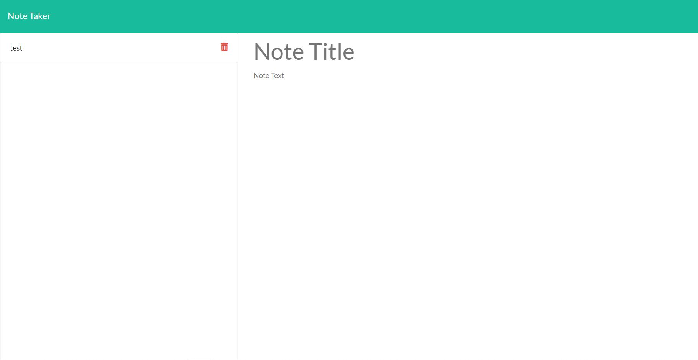

# Note Taker
I have created a web application which uses the HTML,CSS,BOOTSTRAP,JAVASCRIPT, NODE>JS AND EXPRESS.JS. This web application works as a notes application. All inputs are saved and returned after the web has been closed. The use of back-end storage with EXPRESS.JS

[User Story](#User-Story)

[Installation](#installation)

[Project Screenshots](#Project-Screenshots)

[License](#license)

## User Story
As a developer,
I wanted to create a web application which will make it easy for me to save notes and not lose the saved notes that i can refer back to. 
So, that I'm able to refer to notes easier

## Installation

1. npm i (this will install all the required npms)
2. npm express (This will install the express module)

## Project Screenshot

## License

You can refer to the licenses used in this project in the license.md file [here](license.md)

### Author

Aman Kumar

Email: aman.kmr4@yahoo.com
